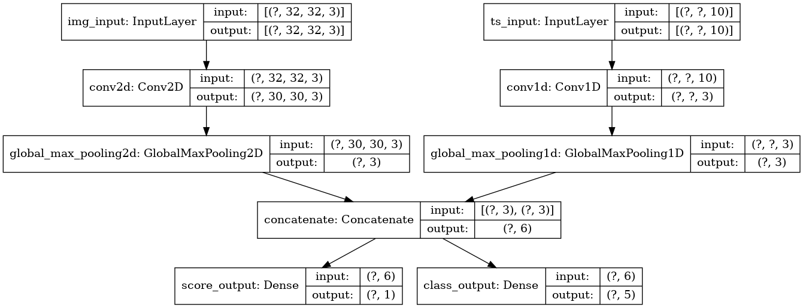

# Model 
```tf.keras.Model```


### fit

**parameters**

**sample_weight** - an array of numbers that specify how much weight each sample in batch should have in computing the total loss. It's commonly used in imbalanced calssification problems. 

``` python
sample_weight = np.ones(shape(len(y_train,)))
sample_weight[y_train == 5] = 2  # class of 5 in y_train gets more weighted
...
model.it(x_train, y_train, sample_weight=sample_weight...)
```

**class_weight** - class weight dict is a more specific instance of the same concept: it maps class indices to the sample weight that should be used for samples belonging to this class. Ex) if class 0 is twice less represented than class 1 in your data, you should use class_weight={0:1, 1:0.5}

``` python
class_weight = {0: 1., 1: 1., 2: 1., 3: 1., 4: 1.,
                # Set weight "2" for class "5",
                # making this class 2x more important
                5: 2.,
                6: 1., 7: 1., 8: 1., 9: 1.}
print('Fit with class weight')
model.fit(x_train, y_train,
          class_weight=class_weight,
          batch_size=64,
          epochs=4)
```


### Passing data to multi-input, multi-output models
``` python
from tensorflow import keras
from tensorflow.keras import layers

image_input = keras.Input(shape=(32, 32, 3), name='img_input')
timeseries_input = keras.Input(shape=(None, 10), name='ts_input')

x1 = layers.Conv2D(3, 3)(image_input)
x1 = layers.GlobalMaxPooling2D()(x1)

x2 = layers.Conv1D(3, 3)(timeseries_input)
x2 = layers.GlobalMaxPooling1D()(x2)

# combine
x = layers.concatenate([x1, x2])

# two outputs
score_output = layers.Dense(1, name='score_output')(x)
class_output = layers.Dense(5, name='class_output')(x)

model = keras.Model(inputs=[image_input, timeseries_input],
                    outputs=[score_output, class_output])


```


``` python
# 1. model compile - List
model.compile(
    optimizer=keras.optimizers.RMSprop(1e-3),
    # list order should match the order of inputs in Model function
    loss=[keras.losses.MeanSquaredError(),
          keras.losses.CategoricalCrossentropy(from_logits=True)],
    metrics=[[keras.metrics.MeanAbsolutePercentageError(),
              keras.metrics.MeanAbsoluteError()],
             [keras.metrics.CategoricalAccuracy()]])

# 2. model compile - dict
model.compile(
    optimizer=keras.optimizers.RMSprop(1e-3),
    # key in dict should match the name of layer(name parameter in layer is used)
    loss={'score_output': keras.losses.MeanSquaredError(),
          'class_output': keras.losses.CategoricalCrossentropy(from_logits=True)},
    metrics={'score_output': [keras.metrics.MeanAbsolutePercentageError(),
                              keras.metrics.MeanAbsoluteError()],
             'class_output': [keras.metrics.CategoricalAccuracy()]},
    loss_weights={'score_output': 2., 'class_output': 1.})


# if you chose not to compute a loss for cetain outputs - not for training
# List loss version
model.compile(
    optimizer=keras.optimizers.RMSprop(1e-3),
    loss=[None, keras.losses.CategoricalCrossentropy(from_logits=True)])

# Or dict loss version
model.compile(
    optimizer=keras.optimizers.RMSprop(1e-3),
    loss={'class_output':keras.losses.CategoricalCrossentropy(from_logits=True)})

# fit on lists
model.fit([img_data, ts_data], [score_targets, class_targets], batch_size = 32, epoch=3)
# fit on dicts
model.fit({"img_input" : img_data, 'ts_input' : ts_data},
          {'score_output': score_targets, 'class_output': class_targets},
          batch_size = 32, epoch=3)

```